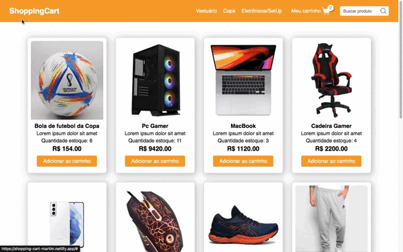
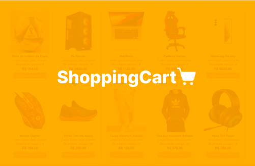

<h1  align="center">ShoppingCart</h1>

<b><i>🛒 &nbsp;Shopping cart with dinamic product cards</i></b>

# 📌 Topics

<!--ts-->

- [Description](#-description)
- [Technologies](#-technologies)
- [Features](#-features)
- [Contributors](#-contributors)
- [Licence](#-licence)
<!--te-->

# 📄 Description

> This project was developed with the objective of applying and improving the knowledge of DOM manipulation with JavaScript. The project consists of a page with a product catalog with filter by segment, search by name and a shopping cart to add/remove products. The page is 100% responsive and the product and cart data are handled in the browser's Web Storage.

<a text-align="center" align="center" href="https://shopping-cart-martim.netlify.app/"> `Link deploy in Netlify` </a>

# 🚀 Technologies

The following tools were used in building the project:

- [Html](https://developer.mozilla.org/en-US/docs/Web/HTML)
- [Css](https://sass-lang.com/)
- [JavaScript](https://developer.mozilla.org/pt-BR/docs/Web/JavaScript)
- [Local Storage](https://developer.mozilla.org/en-US/docs/Web/API/Window/localStorage)
- [Visual Studio Code](https://code.visualstudio.com/)

# 🎯 Features

<pre>
✔️ Seed local storage with products
✔️ List product cards on the page dynamically
✔️ Add products to cart
✔️ Remove products from cart
✔️ Change quantity of products in cart
✔️ Validate quantity of products in cart 
✔️ Responsive Design
</pre>

# 👤 Contributors

<table>
  <tr>
    <td align="center"><a href="https://github.com/martimpalmeira"> <b>Martim Palmeira</b></a> </td>
  </tr>
</table>

# 📑 Licence

This project is under license. See the <a href="https://github.com/martimpalmeira/Disney-Plus/blob/main/LICENCE">MIT LICENSE</a> file for more details.

<a href="#shoppingcart">Back to top</a>
